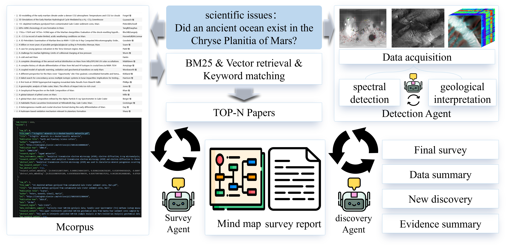

<h1 align="center"><b>Mars Research Agent</b></h1>

<p align="center">
  
</p>

<p align="center">
  
</p>

## Overview

Mars Research Agent connects literature retrieval, relevance screening, survey generation, and mind map construction into a reusable research pipeline for Martian geology and planetary science research.

| Core Capability | Description |
| --- | --- |
| Literature retrieval | Search and rank Mars-related papers from the local corpus. |
| Relevance screening | Identify papers related to a specific scientific question. |
| Status analysis | Extract, organize, and synthesize evidence around the query. |
| Survey generation | Produce structured research summaries from selected papers. |
| Mind map output | Generate a mind map-style representation of the research context. |

<p align="center">
  
</p>

## Data and Modes

The current corpus contains approximately **2,000 Mars-related papers**, mainly covering Martian mineral research, aqueous alteration, geological evolution, and related planetary science questions.

The system supports multiple running modes for different research depths.

| Mode | Best For | PDF Required | Description |
| --- | --- | --- | --- |
| `lightweight` | Fast exploration and initial screening | No | Uses metadata and abstract-level information for rapid retrieval and relevance analysis. |
| `middle` | Query-centered evidence extraction | Yes | Reads selected papers and extracts content directly related to the scientific question. |
| `full` | Deeper survey preparation and analysis | Yes | Performs deeper analysis of highly relevant papers for more complete survey generation. |

<p align="center">
  
</p>

## Quick Start

Run an interactive retrieval demo:

```bash
python scripts/search_demo.py
```

Run the survey pipeline:

```bash
python scripts/run_survey_stage.py \
  --query "What is the evidence for aqueous alteration in Noachian terrains on Mars?" \
  --top_m 30 \
  --batch_size 5 \
  --survey_mode full
```

Run a faster lightweight exploration:

```bash
python scripts/run_survey_stage.py \
  --query "Mars clay minerals in Gale crater" \
  --top_m 20 \
  --survey_mode lightweight
```

Run a query-centered middle-depth analysis:

```bash
python scripts/run_survey_stage.py \
  --query "Did an ancient ocean exist in Chryse Planitia?" \
  --top_m 30 \
  --batch_size 5 \
  --survey_mode middle
```

<p align="center">
  
</p>

## Main Outputs

Outputs are saved under `outputs/` with a timestamped run directory.

| Output | Path |
| --- | --- |
| Retrieved papers | `search_stage/top_m_papers.json` |
| Selected papers | `survey_stage/selected_papers.json` |
| Paper records | `survey_stage/paper_records_*.json` |
| Survey draft | `survey_stage/survey.txt` |
| Mind map | `survey_stage/MindMap.txt` |

Example output structure:

```text
outputs/
└── Chryse_Planitia_ancient_ocean_20260519_125013_md_middle/
    ├── run_config.json
    ├── search_stage/
    │   └── top_m_papers.json
    └── survey_stage/
        ├── selected_papers.json
        ├── paper_records_middle.json
        ├── survey.txt
        └── MindMap.txt
```

<p align="center">
  
</p>

## Project Layout

```text
config.py                         # Project configuration
scripts/                          # Entry scripts
src/lit_agent/agents/             # Agent workflow modules
src/lit_agent/retrieval/          # Retrieval modules
src/lit_agent/prompts/            # Prompt templates
src/lit_agent/utils/              # Utility functions
outputs/                          # Generated research outputs
mmcorpus_bge.json                 # Local corpus index file
mmcorpus_bge.pkl                  # Local corpus embedding/cache file
workflow.png                      # Workflow figure used in README
divider.svg                       # Section divider used in README
```

<p align="center">
  
</p>

## Research Scope

Mars Research Agent is designed for scientific question-driven literature analysis in Martian geology. Typical use cases include:

| Research Direction | Example Question |
| --- | --- |
| Ancient aqueous activity | What evidence supports past water-related processes in a specific Martian region? |
| Mineral detection context | How do mineralogical observations support geological interpretation? |
| Regional geological synthesis | What is known about the geological evolution of a target area? |
| Scientific controversy analysis | What are the competing hypotheses around a specific Martian process? |
| Survey preparation | Which papers provide the most relevant evidence for a research question? |

<p align="center">
  
</p>

## Future Direction

The project will continue toward a full research assistant for Martian geology, connecting literature analysis with multimodal scientific data, mineral detection agents, and discovery-oriented workflows.

Planned extensions include:

| Direction | Goal |
| --- | --- |
| Evidence-centered reasoning | Improve the ability to trace claims back to paper-level evidence. |
| Mineral detection integration | Connect literature analysis with mineral detection results and spatial observations. |
| Region-specific research agents | Support targeted analysis for regions such as Chryse Planitia, Gale crater, Jezero crater, and Noachian terrains. |
| Scientific hypothesis generation | Move beyond summarization toward structured reasoning and research hypothesis discovery. |
| Evaluation framework | Build task-specific evaluation protocols for Martian science research agents. |